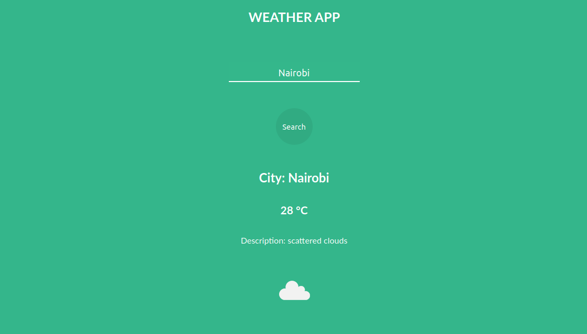
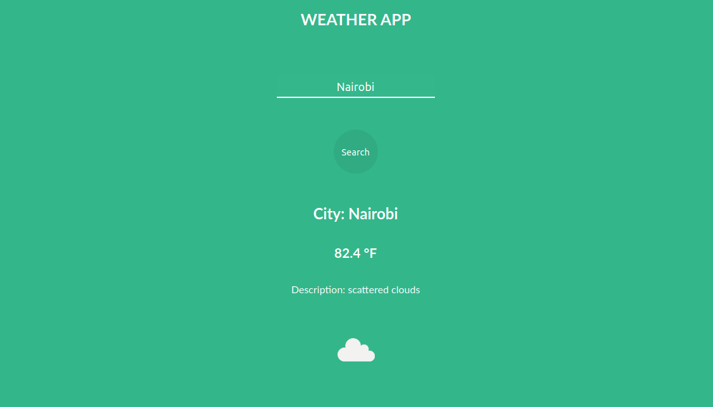

# WEATHER APP

This project is a weather forecast site using the OpenWeatherAPI. The user can search for a specific location and the app will display local weather details. The application does this by consuming the API and showing the desired data to the user. Full Project Description [here](https://www.theodinproject.com/courses/javascript/lessons/weather-app)

## Screenshots






## Online Version
 [Live Demo ](https://kwizl.github.io/weather-app/)

## Content

* [Built With](#built-with)
* [Getting Start](#getting-start)
* [Contributing](#contributing)
* [Acknowledgments](#acknowledgments)
* [Authors](#authors)

## Built With

- HTML5
- CSS3
- Javascript
- ESLint (Linter), Stylint
- Git, Github and VScode
<br>

## Getting Start

#### Get a local copy
Now you need a copy of this application if you are using Git:
```js
git@github.com:kwizl/weather-app.git
```
Click (Download Zip) on the green button (Clone or Download) on this page.

#### Run App

- Type in the terminal `npm install`
- Type in the terminal `npx webpack` or `npx webpack --watch`
- Open the `index.html` in the dist folder on your Browser.`
- Type the name of the city in the search box
- Click the `Search` button or press `Enter`
- To change the temperature units to **Fahrenheit**, hover over the `temperature` value and click.
  To change back to **Celsius** unit click again.

### Contributing

Contributions, issues, and feature requests are welcome!

You can do it on [issues page](issues/).

## Acknowledgments

A special thanks to all Microverse Team and Code Reviewers that guides me through my learning.

## Authors

👤 **Martin Njoroge**

- Github: [@kwizl](https://github.com/kwizl)
- Twitter: [@NjoroKaris](https://twitter.com/NjoroKaris)
- Linkedin: [Martin Njoroge](https://www.linkedin.com/in/martin-kariuki-njoroge/)
